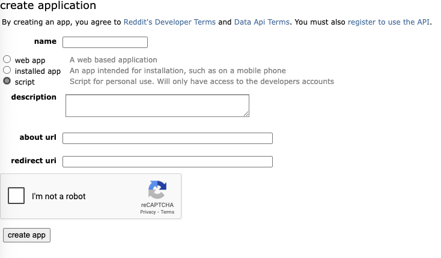

# wallstreetcrawler

crawl reddit channel workstreetbit and counts occurrence of stock symbols in posts. 

## Prerequisites

The following software is necessary steps to be able to work on the project.
  - git version constrol [01]
  - python interpreter >= 3.10 [02]
  - some editor , i.e. zed [03], visual studio code [04] or vim [05]

On macos you might install all necessary packages using 
  - homebrew [06]
  - macports [07]

On windows you might want to use 
  - scoop [08]
  - chocolatey [09]

Additionally, you will need a reddit account with API access and a google account with 
access to google generative AI. 

### System Requirements

  see above for required applications and requirements.txt for further details about
  required python libraries and modules

#### Python Adjustments

wallstreetcrawler uses black as code formatter - to be able use it, it must be installed into the
main python installation. To do so, run the following commands in powershell after having installed python:
```
  > pip install --upgrade pip black
```

## Project Setup

to setup the project just clone it from the git repository 
  
### Installation Steps
     
#### make sure you have installed the system requirements
```
  $ python --version
    Python 3.13.5
```
      
#### Setup the Python Virtual Environment

  After cloning the project enter its python subfolder and execute the following actions:

  ```
    $ cd ./python
    $ python -m venv ./venv
    $ . ./venv/bin/activate
    (venv) python -m pip install --upgrade pip
    (venv) python -m pip install -r requirements.txt
  ```

#### Setup Reddit (from heise article)
  To be able to access the reddit data, you'll need a reddit account and a reddit application that
  controls access to the reddit API.
  - create a reddit account [11]
  - go to the reddit app development site [12]
  - create a app 
    - configure as script :
      
    - result should look like tihis
      
  - From the configured app you will need
    - app_name   - the name you gave the app
    - app_user   - your user name
    - app_id.    - the code below the app name
    - app_secret - the secrets
    - app_version- whatever version you give the app
  - with this you can build an environmant file should contain the folllowing:
    ```
    REDDIT_CLIENT_ID=[app_id]
    REDDIT_CLIENT_SECRET=[app_secret] 
    REDDIT_USER=[app_user]
    # leave this empty, it will be generated from the app data
    REDDIT_USER_AGENT=""
    ```   
  - update env_file in ```config/main.py``` with the location of this file

#### Setup gooogle AI/gemini use (from heise article)
  To access the google AI models and their API youl will need:
  - a google account [13]
  - login to the google AI studio [14]
  - generate an API key there and save it (in your secure storage that you certainly have, haven't you ?)
  - add it to the above generated env file as
  ```
  GEMINI_API_KEY=[your api key]
  ```

## Run the project

### show version and help
```
  # show help
  (venv) python __main__.py --help
```

### Usage Examples
```
  # download and convert NASDAQ data
  python __main__.py --nasdaq_download
  # crawl through reddit posts
  python __main__.py --crawl
  # update result 
  python __main__.py --update
```

## references

[01] https://git-scm.com/

[02] https://www.python.org/

[03] https://zed.dev/

[04] https://code.visualstudio.com/Download

[05] https://neovim.io/

[06] https://brew.sh/

[07] https://www.macports.org/

[08] https://scoop.sh/

[09] https://chocolatey.org/

[10] https://pypi.org/project/google-genai/

[11] https://www.reddit.com

[12] https://www.reddit.com/prefs/apps

[13] https://www.google.com

[14] https://ai.google.dev/gemini-api/docs?hl=de

## Troubleshooting

ideally, create an issue on the repository or mail to development@ths-one.

